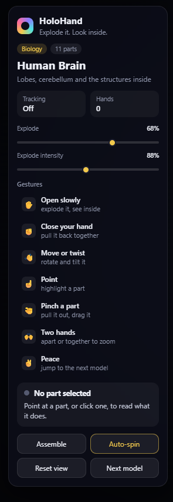
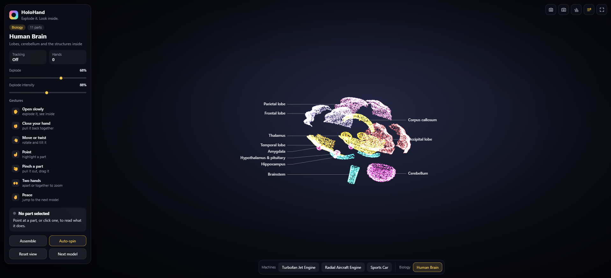
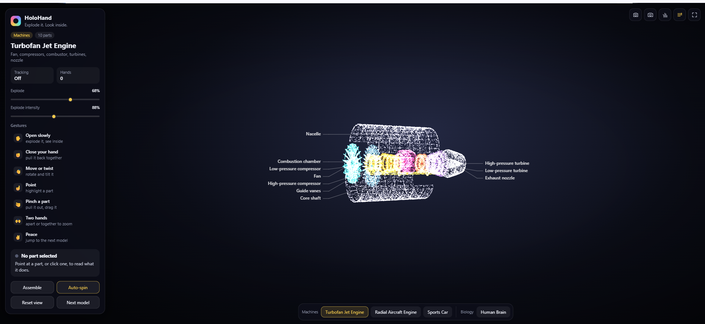

# HoloHand ✋✨

### Interactive 3D Gesture Intelligence Platform

**Explore it. Explode it. Look inside.**

HoloHand is a browser-based 3D visualization workspace that combines real-time hand tracking, gesture-driven interaction, and holographic point-cloud rendering. It enables users to explore procedural educational models, separate components in exploded views, and manipulate virtual objects using natural hand gestures.

Built with **TypeScript, Three.js, WebGL, MediaPipe, and Vite**, HoloHand also supports mouse, touch, and keyboard controls for accessible interaction without a webcam.

---

## 📸 Project Preview

### Main Dashboard



The dashboard brings together the 3D viewport, model selection, gesture guidance, tracking status, and scene controls in a dark holographic interface.

### Model Visualization



Explore procedural mechanical and anatomical models with animated point clouds, component separation, and visual highlighting.

### Gesture Interaction



Use webcam-based hand tracking to interact with virtual objects, or switch to mouse and keyboard controls whenever needed.

> **Media paths:** Store the three images in `public/images/` using the filenames shown above, or update the paths to match your actual files.

---

## 🎬 Demo Video

Watch the HoloHand demonstration to see the interface, 3D models, exploded-view animation, and gesture-driven interactions.

<video controls playsinline preload="metadata" width="100%">
  <source src="public/videos/holohand-demo.mp4" type="video/mp4">
  Your browser does not support embedded video. Open the demo file from the repository's public/videos directory.
</video>

**Video file:** `public/videos/holohand-demo.mp4`

Replace this path with your actual video filename if necessary. Git hosting platforms may not render HTML video directly inside a README; if the video does not play, link to the video file or use a hosted demo.

---

## ✨ Features

### 🖐️ Real-Time Hand Tracking

* Webcam-based hand landmark detection using MediaPipe Hand Landmarker.
* Support for zero, one, or two detected hands.
* Gesture stabilization to reduce accidental transitions.
* Configurable tracking behavior and sensitivity where implemented.
* Browser-based processing without requiring a dedicated application backend.

### 🧠 Gesture-Based Interaction

* Open palm to expand the model.
* Closed fist to assemble the model.
* Hand movement to rotate or tilt the scene.
* Pointing to highlight or select components.
* Pinching to grab and drag components.
* Two-hand movement to control zoom.
* Peace sign to switch between models.

Actual gesture behavior depends on the implementation, tracking confidence, lighting, and camera position.

### 🌌 Holographic 3D Rendering

* Three.js and WebGL rendering.
* Custom GLSL shader effects.
* Animated point-cloud geometry.
* Exploded and assembled views.
* Component highlighting and selection.
* Smooth model transitions.
* Interactive camera and scene controls.
* Performance-conscious GPU resource management.

### 🧩 Educational 3D Models

Explore four procedural models:

| Model                  | Example components                                                               |
| ---------------------- | -------------------------------------------------------------------------------- |
| Turbofan Jet Engine    | Fan, compressor stages, combustor, turbines, shaft, nozzle                       |
| Radial Aircraft Engine | Cylinders, pistons, connecting rods, crankshaft                                  |
| Sports Car             | Body, chassis, wheels, brakes, drivetrain, interior                              |
| Human Brain            | Cerebral regions, lobes, cerebellum, brainstem, and other represented structures |

These models are designed for interactive visualization and education. They are not validated CAD assemblies, engineering simulations, or clinical anatomical models.

### 🖱️ Multiple Input Methods

HoloHand remains usable without webcam input.

* Mouse-based rotation and zoom.
* Click or tap to select components.
* Keyboard shortcuts.
* Accessible buttons and sliders.
* Manual camera and model controls.

### 🤖 Interaction Agent

The intended interaction architecture separates perception, gesture classification, intent resolution, action validation, and scene execution.

A typed interaction interface helps prevent invalid actions and keeps the gesture system independent of rendering internals. Core functionality does not require a paid LLM API.

---

## 🛠️ Technology Stack

| Technology             | Purpose                                    |
| ---------------------- | ------------------------------------------ |
| TypeScript             | Typed application logic                    |
| JavaScript ES modules  | Modular browser execution                  |
| Three.js               | 3D scene management and rendering          |
| WebGL / GLSL           | GPU rendering and custom shader effects    |
| MediaPipe Tasks Vision | Hand landmark detection                    |
| WebAssembly            | Vision runtime support                     |
| Vite                   | Development server and production bundling |
| Vitest                 | Unit and integration testing               |
| Playwright             | Browser end-to-end testing                 |
| ESLint and Prettier    | Code quality and formatting                |

The exact dependencies and versions should be verified against the delivered `package.json` and lockfile.

---

## 💻 System Requirements

* Node.js 18 or later, or the version required by the project dependencies.
* npm.
* A modern browser with WebGL support.
* Webcam access for gesture interaction.
* `localhost` during development or HTTPS when deployed for camera access.

A dedicated GPU is **not mandatory**. Integrated graphics can be sufficient for moderate scenes, while hardware acceleration is recommended for smoother rendering and higher particle counts.

Actual performance depends on the processor, graphics hardware, browser, rendering resolution, and model complexity.

---

## 🚀 Installation and Setup

### 1. Clone or download the repository

```bash
git clone <YOUR_REPOSITORY_URL>
cd HoloHand
```

If you already downloaded the project, open a terminal in its root directory instead.

### 2. Install dependencies

```bash
npm install
```

The setup script may prepare local MediaPipe assets. Network access may be needed if the model or runtime files are not already available.

### 3. Start the development server

```bash
npm run dev
```

Open the local URL printed in your terminal, commonly:

```text
http://localhost:5173
```

### 4. Start the application

1. Open the HoloHand interface.
2. Select **Start camera**.
3. Grant permission to use the webcam.
4. Wait for the hand-tracking model to initialize.
5. Place your hand in the camera's field of view.
6. Use the gesture guide to interact with the 3D scene.

Alternatively, choose **Use mouse instead** or use the manual controls if you do not want to use the webcam.

---

## 🖐️ Gesture Controls

| Gesture                          | Action                               |
| -------------------------------- | ------------------------------------ |
| Open palm                        | Expand the model                     |
| Closed fist                      | Assemble the model                   |
| Move or twist hand               | Rotate or tilt the model             |
| Point with index finger          | Highlight or select a component      |
| Pinch and hold                   | Grab and drag a component            |
| Release pinch                    | Drop the selected component          |
| Move two hands apart or together | Zoom the scene                       |
| Peace sign                       | Switch to the next model             |
| No hand detected                 | Return to a safe, non-dragging state |

Gesture recognition is not perfect. Hand occlusion, low lighting, camera distance, and ambiguous poses may affect the result.

---

## ⌨️ Keyboard and Manual Controls

The application also provides manual interaction methods.

| Input        | Action                                              |
| ------------ | --------------------------------------------------- |
| Mouse drag   | Rotate the scene                                    |
| Mouse wheel  | Zoom                                                |
| Click or tap | Select or inspect a component                       |
| Space        | Toggle the assembled/exploded state, if implemented |
| Arrow keys   | Navigate or control the scene, as implemented       |
| `1`–`4`      | Select a model, if implemented                      |
| `R`          | Reset the view, if implemented                      |

Check the application's help panel or input bindings for the exact shortcuts supported by your current build.

---

## 🏗️ Architecture Overview

The application follows a modular processing pipeline:

```text
┌──────────────────────┐
│    Webcam / Input    │
└──────────┬───────────┘
           ↓
┌──────────────────────┐
│ MediaPipe Hand       │
│ Landmark Detection   │
└──────────┬───────────┘
           ↓
┌──────────────────────┐
│ Landmark Processing  │
│ Gesture Classification│
│ Temporal Stabilization│
└──────────┬───────────┘
           ↓
┌──────────────────────┐
│ Interaction Agent    │
│ Intent Resolution    │
│ Action Validation    │
└──────────┬───────────┘
           ↓
┌──────────────────────┐
│ Interaction Interface│
│ Scene State Updates  │
└──────────┬───────────┘
           ↓
┌──────────────────────┐
│ Three.js Scene       │
│ Models and Shaders   │
└──────────┬───────────┘
           ↓
┌──────────────────────┐
│ WebGL Rendering      │
└──────────────────────┘
```

### Architectural Responsibilities

* **Vision layer:** Camera management, MediaPipe initialization, and landmark output.
* **Gesture layer:** Landmark geometry, gesture classification, confidence checks, and stabilization.
* **Agent layer:** Intent resolution, action validation, and interaction dispatch.
* **Scene layer:** Camera controls, picking, object manipulation, animation, and scene state.
* **Rendering layer:** Point-cloud generation, shader management, and exploded-view effects.
* **Model layer:** Procedural geometry, component definitions, and model registration.
* **UI layer:** Controls, tracking status, model selection, settings, and error feedback.

See `ARCHITECTURE.md` for implementation-specific details if included in the repository.

---

## 📂 Project Structure

The following is a representative structure for the modular application:

```text
HoloHand/
├── public/
│   ├── images/
│   │   ├── holohand-dashboard.png
│   │   ├── holohand-models.png
│   │   └── holohand-gestures.png
│   ├── videos/
│   │   └── holohand-demo.mp4
│   ├── models/
│   │   └── hand_landmarker.task
│   └── wasm/
├── scripts/
│   └── setup.mjs
├── src/
│   ├── app/
│   ├── vision/
│   ├── gestures/
│   ├── agent/
│   ├── interaction/
│   ├── scene/
│   ├── rendering/
│   ├── models/
│   ├── ui/
│   ├── utils/
│   └── main.ts
├── tests/
│   ├── unit/
│   ├── integration/
│   └── e2e/
├── index.html
├── package.json
├── package-lock.json
├── tsconfig.json
├── vite.config.ts
├── README.md
├── ARCHITECTURE.md
└── SECURITY.md
```

This is a target structure. Keep the documentation synchronized with the actual repository rather than creating empty directories solely to match the example.

---

## 🧪 Testing and Quality Assurance

Run the quality checks configured in your `package.json`:

```bash
npm run typecheck
npm test
npm run lint
npm run format:check
npm run test:e2e
npm run build
```

To preview the production build locally:

```bash
npm run preview
```

Not every repository defines every script. If a command is unavailable, configure the associated tool and script before relying on it.

### Recommended Test Coverage

* Gesture geometry and classification.
* Gesture stabilization and pinch transitions.
* Model registration and component identifiers.
* Explosion animation and model switching.
* Interaction-agent intent validation.
* Camera initialization and failure recovery.
* Application start/stop lifecycle.
* Resource cleanup.
* Mouse and keyboard interaction.
* Production build and browser rendering.

Use mocks for webcam and MediaPipe dependencies in automated tests. Browser tests should not require a physical camera to test the manual-control workflow.

---

## ⚡ Performance

HoloHand uses browser-based 3D rendering and real-time vision processing.

Performance improvements should include:

* Reusing geometry buffers and materials.
* Avoiding unnecessary allocations in animation loops.
* Limiting concurrent hand-tracking inference operations.
* Adjusting particle density to device capabilities.
* Reducing work when the browser tab is hidden.
* Disposing of GPU resources when models or scenes are removed.
* Providing a simplified rendering fallback when necessary.

A target of 60 FPS is useful for development, but actual frame rates must be measured on representative hardware.

---

## 🔒 Privacy and Security

HoloHand is designed around local browser processing.

* Request webcam access only after a clear user action.
* Explain why camera access is required.
* Stop media tracks when tracking is stopped or the application is disposed.
* Do not record or upload video unless a separately documented feature explicitly does so.
* Document any external MediaPipe asset downloads or CDN fallbacks.
* Never expose private API keys in frontend code.
* Validate external asset sources and handle loading failures.
* Avoid collecting unnecessary personal data.

Review `SECURITY.md` if present. Confirm privacy claims against the actual implementation and network behavior rather than relying on documentation alone.

---

## 🧰 Troubleshooting

### Camera access fails

* Use `localhost` or HTTPS.
* Allow camera access in the browser's site settings.
* Check whether another application is using the webcam.
* Confirm that a camera device is available.
* Retry startup or use manual controls.

### MediaPipe does not initialize

* Check the browser console for errors.
* Verify that the hand-landmark model and WASM assets exist.
* Confirm that configured asset URLs are reachable.
* Check the network connection if a CDN fallback is used.
* Retry initialization after resolving the reported error.

### The 3D scene is slow

* Use a current browser.
* Enable hardware acceleration if available.
* Reduce rendering resolution or particle density if supported.
* Close GPU-intensive applications.
* Inspect WebGL and shader errors in the developer console.

### Gesture recognition is unreliable

* Improve lighting.
* Keep the hand fully visible.
* Avoid rapid movements while testing.
* Move the hand closer to the camera if landmarks are unstable.
* Check the tracking status and gesture confidence, if exposed.

### A script is missing

Inspect `package.json` to determine which commands are actually configured. Install or configure the required tooling before running the associated check.

---

## 🗺️ Roadmap

Potential future improvements include:

* More educational and mechanical models.
* Improved gesture calibration and personalized sensitivity.
* Model quality presets for different hardware.
* Better component descriptions and educational annotations.
* Enhanced accessibility and localization.
* Expanded automated browser testing.
* Optional AI-assisted scene exploration through a validated interaction interface.
* Additional model import formats, if compatible with the rendering architecture.

Roadmap items are proposals, not promises that these features are already implemented.

---

## 🤝 Contributing

Contributions and improvements are welcome.

1. Create a branch for your change.
2. Keep vision, gestures, agent, scene, model, and UI logic separated.
3. Add tests for new functionality and bug fixes.
4. Run the available quality checks.
5. Update documentation when behavior or configuration changes.
6. Document new external dependencies and network behavior.

---

## 📄 License

See the repository's `LICENSE` file for the applicable terms.

If no license file is present, establish the intended license before redistributing the source code or assets.

---

## 🙌 Acknowledgments

HoloHand builds on the broader web graphics and computer-vision ecosystem, including:

* [Three.js](https://threejs.org/docs/)
* [MediaPipe Hand Landmarker](https://ai.google.dev/edge/mediapipe/solutions/vision/hand_landmarker/web_js)
* [Vite](https://vite.dev/guide/)
* [Vitest](https://vitest.dev/guide/)
* [Playwright](https://playwright.dev/docs/intro)

---

**HoloHand — Explore the invisible structure of things through natural interaction.**
# HoloHand
